# Impact of AI usage on Global Industries
## 📌 Overview
This project analyzes the global adoption of AI in media content creation, covering trends in content types, industry usage, regional adoption, and ethical considerations. Using statistical data and visualizations, it highlights how AI is shaping the way media is produced and consumed worldwide.

## 📊 Dataset
The dataset contains information on:
- AI adoption rates across different industries
- Types of content generated using AI
- Regional distribution of AI adoption
- Benefits and challenges of AI usage
- Ethical concerns and public perception

**Source:** [Your Dataset Source Here]

---

## 📈 Analysis Performed
The analysis includes:
- Comparative analysis of AI adoption across industries
- Distribution of AI-generated content types
- Geographic adoption patterns
- Perceived benefits and challenges
- Ethical concerns breakdown

---

### 📊 Visualizations & Insights  

| **Industries have the highest AI adoption rates** | **Countries have the highest AI adoption rates** |
| :---: | :---: |
| 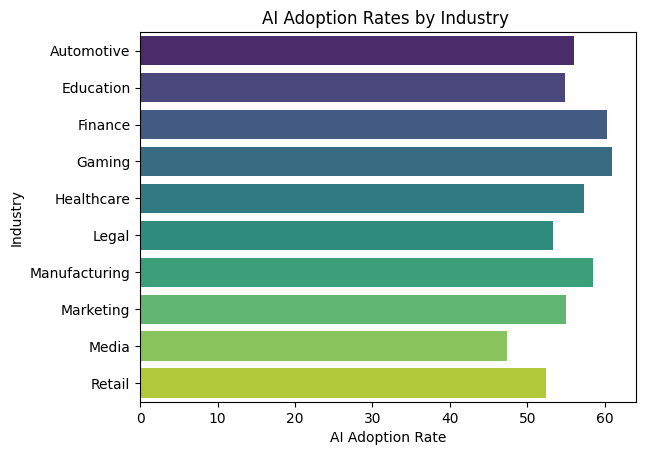 | 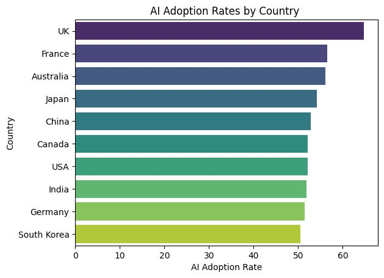 |
| AI adoption is consistently high across the board — no country or industry in the charts drops below ~48%. | Certain sectors (Gaming, Finance) and regions (UK, France) are pushing the upper limits, showing they could be early leaders in AI-driven economic advantage. |

| **Impact of AI adoption rate on Revenue** | **Job Loss due to AI by Industry** |
| :---: | :---: |
| 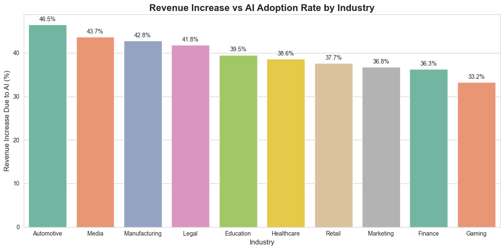 | 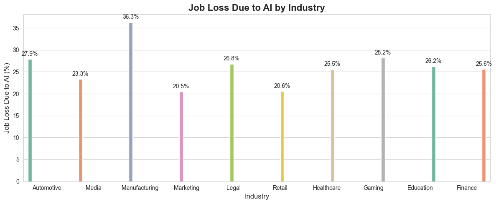 |
| Industries like Automotive, Media, and Manufacturing show the highest revenue gains from AI adoption.| Manufacturing experiences the highest job losses, indicating significant automation impact. |

| **Job Loss due to AI by Country** | **Sectors showing the highest collaboration rates between humans and AI** |
| :---: | :---: |
| 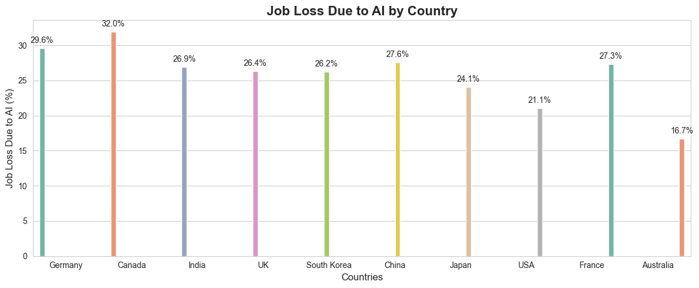 | 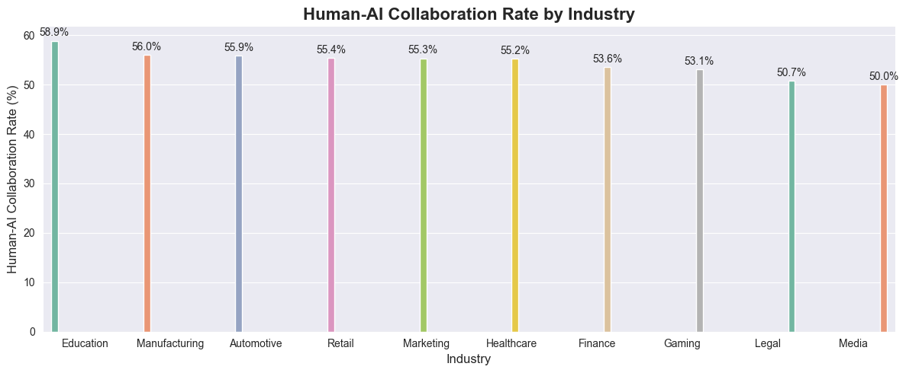 |
| Across countries, Canada and Germany report the highest job loss percentages, while the USA and Australiya shows relatively low job losses | Education leads with the highest Human-AI collaboration rate (58.9%), Media shows the lowest (50.0%) |

| **Relationship between human-AI collaboration rate and Consumer trus** | **Relationship between job loss due to AI and revenue increase** |
| :---: | :---: |
| 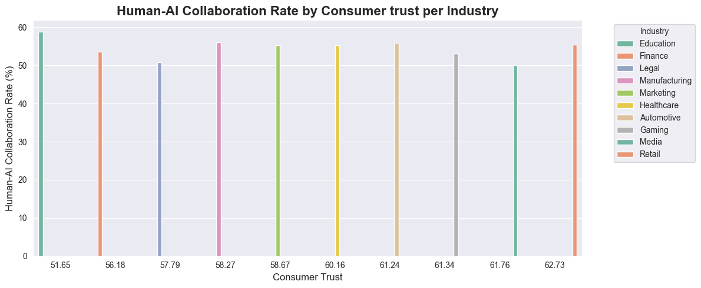 | 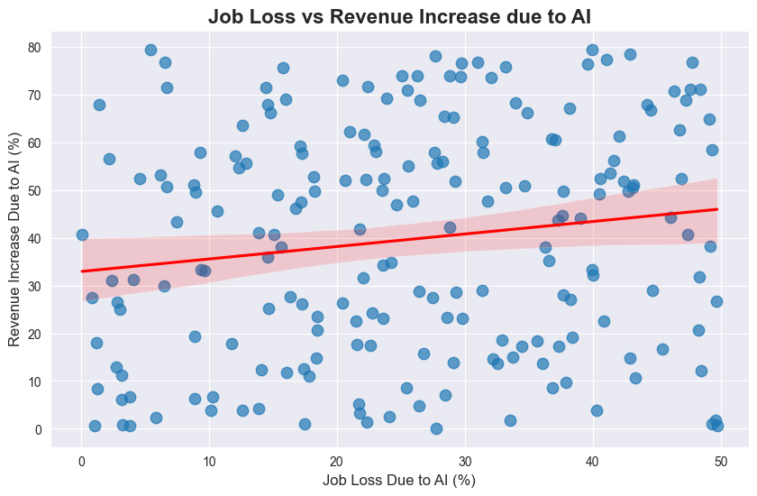 |
| Industries with higher collaboration rates don’t always have the highest consumer trust. | Industries seeing higher job loss due to AI tend to show a small but positive correlation with increased revenue, suggesting some economic benefits despite workforce cuts. |

| **Relationship between job loss due to AI and Consumer Trust** | **Global Trend in Market Shares of AI Companies** |
| :---: | :---: |
| 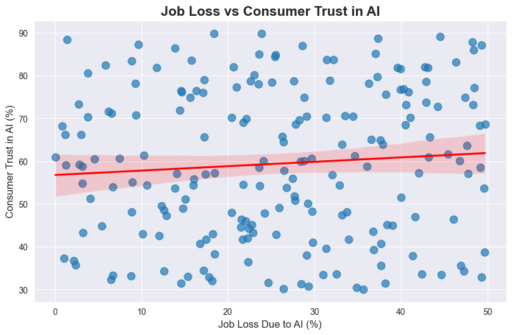 | 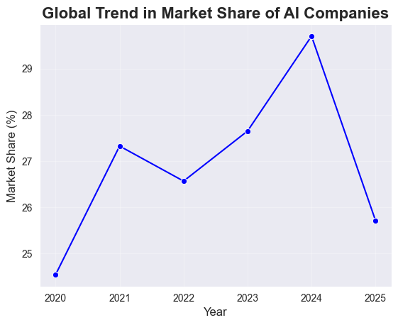 |
| Consumer trust in AI also shows a slight upward trend with job losses, meaning job reductions haven’t strongly eroded public trust overall. | Sharp Decline in 2025 – The drop to ~25.7% in 2025 signals potential saturation, increased competition, or reduced adoption. |

| **Trend in top Tech Countries** |   |
| :---: | :---: |
| 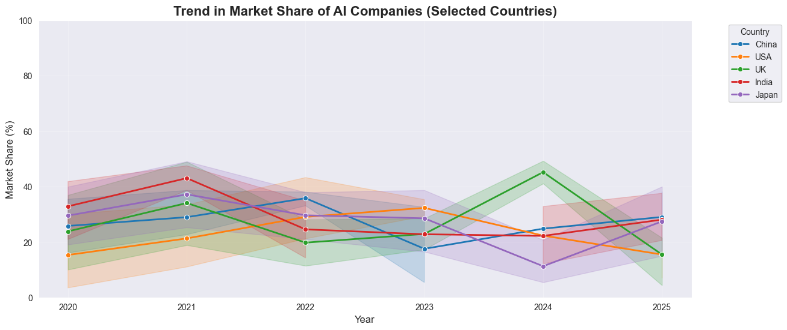 |   |
| From 2020–2025, the UK surged to lead the global AI market, overtaking a declining USA, while China grew with volatility and India showed steady, consistent gains. |  

## 📝 Conclusion
From this analysis, we can conclude:

1. **High Global AI Adoption:** No country or industry drops below \~48% adoption, showing strong worldwide integration.
2. **Emerging Leaders:** Sectors like Gaming and Finance, and regions like the UK and France, are pushing the upper limits of adoption.
3. **Narrowing Gap:** The spread between the highest and lowest adoption rates is small, indicating global convergence in AI usage.
4. **Revenue vs Job Loss:** Automotive, Media, and Manufacturing see high revenue gains from AI, but Manufacturing also faces the highest job losses.
5. **Country-Specific Impacts:** Canada and Germany report the highest job loss percentages, while the USA maintains low job losses despite AI growth.
6. **Collaboration vs Trust Dynamics:** Education has the highest AI-human collaboration rate but low trust, while Retail shows high trust with moderate collaboration.
7. **Balanced Industries:** Marketing and Healthcare maintain a healthy balance between collaboration (\~55%) and trust (\~58–60%).
8. **Weak Link Between Job Loss & Trust/Revenue:** Job losses show only a slight positive correlation with revenue and trust, with high variability across contexts.
9. **Global Market Trends:** AI companies’ global market share grew from \~24.5% in 2020 to \~29.6% in 2024 before dropping sharply to \~25.7% in 2025.
10. **Country-Specific Market Shifts:** UK surged to the top by 2024, USA declined after 2021, China grew with volatility, and India showed steady, consistent growth.

---

## 📜 Author 
👨‍💻 *Sahil Chakraborty*
